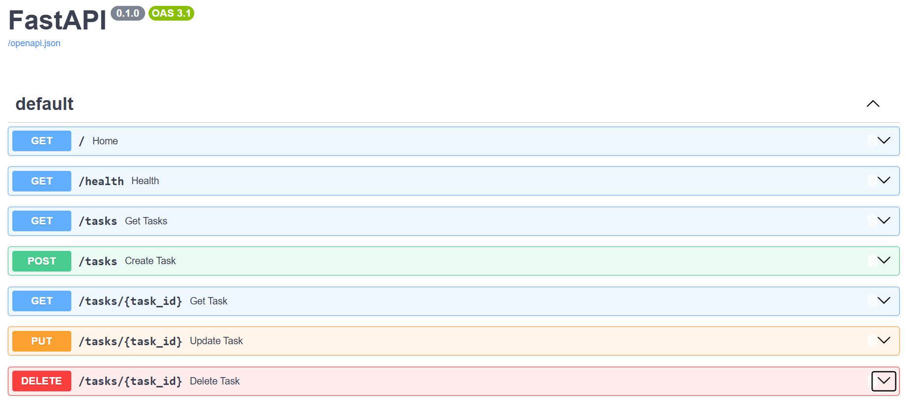

# Task API

A simple CRUD API for managing a to-do list, built using **Python** and **FastAPI**.

The API uses **in-memory storage**, so no database is required.

## Features

- Create a task
- Get all tasks
- Get a task by ID
- Update a task
- Delete a task
- Input validation
- Proper HTTP status codes
- Interactive Swagger API documentation
- In-memory task storage

## Tech Stack

- Python 3.10+
- FastAPI
- Uvicorn
- Pydantic

## Project Structure

```text
todo-api/
│
├── screenshots/
│   └── swagger.png
│
├── main.py
├── requirements.txt
├── .gitignore
└── README.md
```

## Installation

### 1. Clone the repository

```bash
git clone https://github.com/shivam183-star/FlyRank-AI-Internship.git
cd to-do-api
```

### 2. Create a virtual environment

```bash
python -m venv .venv
```

### 3. Activate the virtual environment

#### Windows

```bash
.venv\Scripts\activate
```

#### macOS / Linux

```bash
source .venv/bin/activate
```

### 4. Install dependencies

```bash
pip install -r requirements.txt
```

### 5. Run the API

```bash
uvicorn main:app --reload
```

The API will be available at:

```text
http://localhost:8000
```

## API Endpoints

| Method | Endpoint | Description | Success Status |
|---|---|---|---|
| GET | `/` | Get API information | 200 |
| GET | `/health` | Check API health | 200 |
| GET | `/tasks` | Get all tasks | 200 |
| GET | `/tasks/{id}` | Get a task by ID | 200 |
| POST | `/tasks` | Create a new task | 201 |
| PUT | `/tasks/{id}` | Update a task | 200 |
| DELETE | `/tasks/{id}` | Delete a task | 204 |

## Example API Usage

### Create a Task

```bash
curl -i -X POST http://localhost:8000/tasks -H "Content-Type: application/json" -d "{\"title\":\"Buy milk\"}"
```

Example response:

```text
HTTP/1.1 201 Created
Content-Type: application/json

{
    "id": 4,
    "title": "Buy milk",
    "done": false
}
```

### Get All Tasks

```bash
curl -i http://localhost:8000/tasks
```

### Get a Task by ID

```bash
curl -i http://localhost:8000/tasks/1
```

### Update a Task

```bash
curl -i -X PUT http://localhost:8000/tasks/1 -H "Content-Type: application/json" -d "{\"title\":\"Learn Advanced FastAPI\",\"done\":true}"
```

### Delete a Task

```bash
curl -i -X DELETE http://localhost:8000/tasks/2
```

## Error Handling

The API handles common errors using appropriate HTTP status codes:

- **400 Bad Request** — Invalid or empty task title / invalid update body
- **404 Not Found** — Task with the requested ID does not exist
- **204 No Content** — Task successfully deleted

## Swagger UI

FastAPI automatically provides interactive API documentation.

Open:

```text
http://localhost:8000/docs
```

The Swagger UI can be used to test all CRUD operations directly from the browser.



## Assignment Completion

This project implements the required CRUD operations using FastAPI with in-memory data storage and includes Swagger documentation and GitHub documentation.

## Author

**Shivam Singh**

BTech Artificial Intelligence and Machine Learning